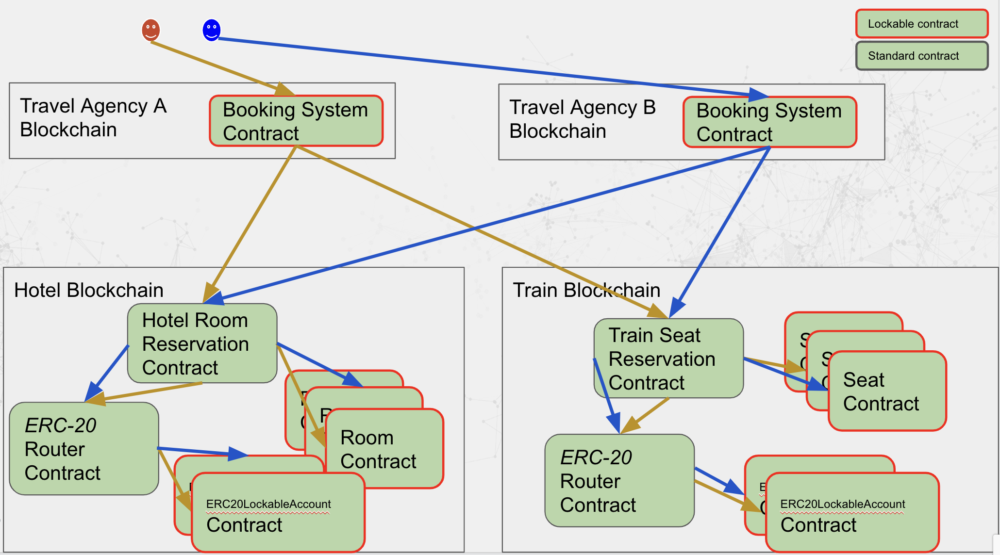

# Hotel - Train sample code

## Introduction
This sample demonstrates:
* A crosschain transaction that spans three blockchains. The travel
agency is on one blockchain. The hotel is on another blockchain. The
train is on a third blockchain.  
* The use of non-lockable router - lockable item paradigm.
* How to construct a lockable ERC20 contract. 

## Running the Sample Code

This sample is to be used with three the crosschain-enabled Hyperledger Besu instances
each operating as a node on three separate sidechains. See [../../README>md] 
for details of how to do this.  

## Details

There are four blockchains as shown in the diagram below. The sample code
just implements a single travel agency - though could be extended to match the diagram.

The Hotel operates a blockchain to allow travel agencies and individuals 
to book and pay for rooms. There is a Hotel Router contract and individual 
Hotel Room contracts. The router is non-lockable and is used to locate the 
appropriate room contract. The room contracts are lockable, allowing them
to be updated as part of a crosschain transaction. The Hotel also has a modified ERC 20 contract, which consists of a non-lockable router
contract and one or more ERC 20 Lockable Account contracts per Ethereum account. 

Similarly, the Train operates a blockchain with a non-lockable Train Router
contract and lockable Train Seat contracts, and a non-lockable ERC 20 router 
and one or more ERC 20 Lockable Account contracts per Ethereum account.

To book a hotel and train, the travel agency submits a crosschain transaction
to the Travel Agency blockchain. This dispatches subordinate transactions
to the Hotel and Train Router contracts. These contracts locate available 
rooms (seats) at or less than the specified price for the given day, and
have the ERC 20 router contract affect the payment. The code checks to  
see if a Room, Seat, or ERC 20 Lockable  Account contract are locked 
prior to accessing them, and skips them as they are part of an active
crosschian transaction.

