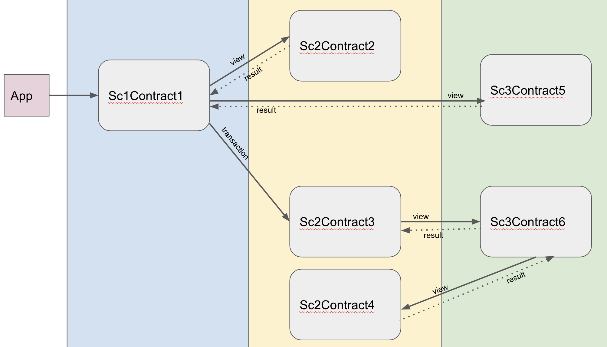

# Three Chains, Six Contracts sample code

Note that the terms _sidechain_ and _blockchain_ are used in this sample. For the purposes
of this sample, they should be considered the same thing. 

## Introduction
This sample demonstrates:
 * The deployment of lockable contracts. 
 * The construction of a complex crosschain transaction consisting of multiple subordinate transactions and 
views. 
* How to handle conditional logic in contracts.
* Solidity code to execute crosschain calls.

## Running the Sample Code

This sample is to be used with three the crosschain-enabled Hyperledger Besu instances
each operating as a node on three separate sidechains. See [../../README>md] 
for details of how to do this.  


## Details

There are six sample contracts deployed to three sidechains as shown in the diagram below.



### Sc1Contract1.doStuff
The application calls the function **doStuff** in contract **Sc1Contract1** which is deployed to 
sidechain 1. The functions code is shown below.

```solidity
function doStuff(uint256 _val) external {
  uint256 sc2Val = crosschainViewUint256(sc2, address(contract2), abi.encodeWithSelector(contract2.get.selector));
  val = sc2Val;

  if (_val > sc2Val) {
    uint256 calc = crosschainViewUint256(sc3, address(contract5), abi.encodeWithSelector(contract5.calculate.selector, _val, sc2Val));
    crosschainTransaction(sc2, address(contract3), abi.encodeWithSelector(contract3.process.selector, calc) );
    val = calc;
  }
}
```
Walking through the code:
1. The **get** function in Sc2Contract2 on sidechain 2 is called.
2. The result of the **get** function is assigned to the state variable **val**.
3. If the **_val** parameter is greater than the result of the **get** function execute the following:
4. The **calculate** function in Sc3Contract5 is called, passing in the **_val** parameter and the 
result of the **get** function.
5. The result of the **calculate** function is passed to the **process** function in Sc2Contract3 on sidechain 2.
6. The result of the **calculate** function is assigned to the state variable **val**.

### Sc2Contract2.get
The **get** function in Sc2Contract2 is shown below.
```solidity
function get() external view returns(uint256) {
  return val;
}
```
Walking through the code:
1. The state variable **val** is returned.

### Sc3Contract5.calculate
The **calculate** function in Sc3Contract5 is shown below.
```solidity
function calculate(uint256 _val1, uint256 _val2) external view returns(uint256) {
    return val + _val1 + _val2;
}
```
Walking through the code:
1. The sum of the state variable **val** plus the two parameters is returned.

## Sc2Contract3.process
The **process** function in Sc2Contract3 is shown below.
```solidity
function process(uint256 _val) external {
    uint256 sc3Val = crosschainViewUint256(sc3, address(contract6), abi.encodeWithSelector(contract6.get.selector, val));
    val = _val + sc3Val;
}
```
Walking through the code:
1. The state variable **val** is passed to the **get** function in Sc3Contract6.
2. The state variable **val** is set as the sum of the parameter **_val** and the result of the **get** function.

## Sc3Contract6.get
The **get** function in Sc3Contract6 is shown below.
```solidity
function get(uint256 _val) external view returns(uint256) {
    uint256 sc2Val = crosschainViewUint256(sc2, address(contract4), abi.encodeWithSelector(contract4.get.selector, val));
    return _val + sc2Val;
}
```
Walking through the code:
1. The state variable **val** is passed to the **get** function in Sc2Contract4.
2. The sum of the **_val** parameter and the result of the **get** function is returned.

## Sc2Contract4.get
The **get** function in Sc2Contract4 is shown below.
```solidity
function get(uint256 _val) external view returns(uint256) {
    return val + _val;
}
``` 
Walking through the code:
2. The sum of the **_val** parameter and the **val** state variable is returned.


# Code design features
## Solidity Interfaces
Functions involved in crosschain calls are only ever called via interfaces. From a
software development perspective, this limits which functions are exposed as ones which
are intended to be called as part of crosschain calls. It should be noted that any public
or external function in a lockable contract could be called as part of a crosschain 
transaction.  

## Crosschain.sol
**Crosschain.sol** is a set of helper functions that abstract away most of the complication for 
generation of crosschain calls.

## Call Simulator
The Java code replicates the business logic in the contracts in a call simulator. The
simulator is used to determine which code paths are called and the expected parameter
values for each call. Doing this is required as all Crosschain Transactions and all
nested Subordinate Transactions and Views are signed.
 

# Modifying the Sample Code
Steps to tailoring the sample code:
* Git clone the [sidechains-web3j](https://github.com/PegaSysEng/sidechains-web3j) repo to the 
same location as this repo.
* Build the sidechains-web3j code and build the code generator, following instructions 
in that repo.
* Modify Solidity code in this sample.
* Generate updated Java wrapper code using the command:
```bash
bash ./generatewrapper.sh
```
* Copy the updated wrapper files from the **build** directory to the source directory.
* Update the Call Simulator code.
